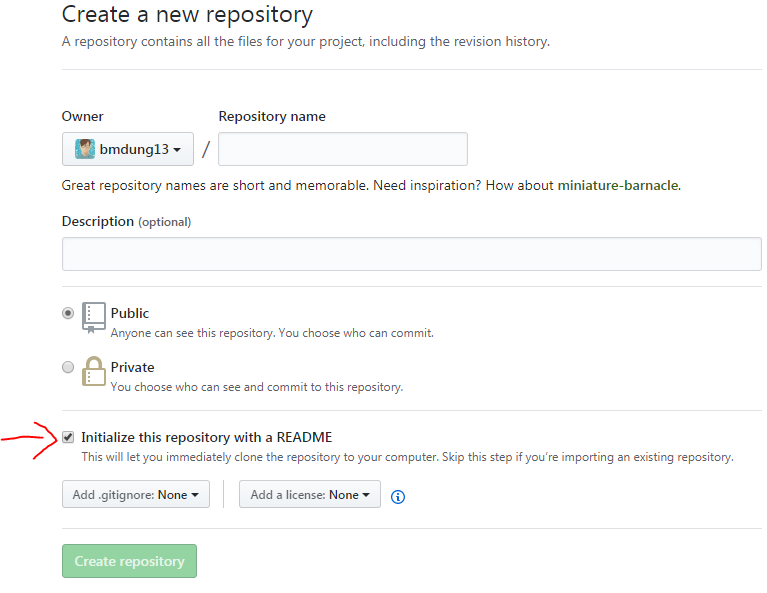

# Markdown Guide
*If you use ten minutes to read this, you can learn and write Markdown*.<br>
*Markdown for everyone* :+1: :punch:

## What is Markdown?
[Markdown](https://en.wikipedia.org/wiki/Markdown) is a lightweight markup language with plain text formatting syntax, with the `.md` or `.markdown` extension. It is designed so that it can be converted to HTML and many other formats using a tool by the same name.

Markdown is often used to format readme files like this file :smile:, for writing messages in online discussion forums, and to create rich text using a plain text editor.

For more information, see [Markdown](https://en.wikipedia.org/wiki/Markdown) in Wikipedia, more other tutorial see [“Basic writing and formatting syntax”](https://help.github.com/articles/basic-writing-and-formatting-syntax/) in the GitHub Help or ["Mastering Markdown"](https://guides.github.com/features/mastering-markdown/).

### Create a Markdown file

Create a text file called namefile.md or create a new repository with tick into "Initialize this repository with a README":



## Table of contents

* [Headers](#headers)
* [Styling text](#styling-text)
* [Lists](#lists)
	* [Unordered](#unordered)
	* [Ordered](#ordered)
	* [Nested Lists](#nested-lists)
* [Quoting](#quoting)
	* [Quoting text](#quoting-text)
	* [Quoting code](#quoting-code)
* [Links](#links)
	* [Anchor links](#section-links)
	* [Relative links](#relative-links)
* [Images](#images)
	* [GIFs](#gifs)
	* [Status images](#status-images)
* [Task lists](#task-lists)
* [Mentioning people and teams](#mentioning-people-and-teams)
* [Emoji](#emoji)
* [Referencing issues, pull requests and SHA references ](#referencing-issues,-pull-requests-and-sha-references)
* [Paragraphs and line breaks](#paragraphs-and-line-breaks)
* [Tables](#tables)
* [Ignoring Markdown formatting](#ignoring-markdown-formatting)

## Headers
To create a heading, add one to six `#` symbols before your heading text. The number of `#` you use will determine the size of the heading.
```
# The largest heading
## The second largest heading
...
###### The smallest heading
```
*Output:*
># The largest heading
>## The second largest heading
>**. . .**
>###### The smallest heading

## Styling text
You can indicate emphasis with bold, italic,or both, or strikethrough text.

Style | Syntax | Example | Output
----- | ------ | ------- | ------
Bold | `**text**` or `__text__` | `**This is bold text**` | **This is bold text**
Italic | `*text*` or `_text_` | `*This text is italicized*` | *This text is italicized*
Strikethrough | `~~text~~` | `~~This was mistaken text~~` | ~~This was mistaken text~~

## Lists
### Unordered
You can make an unordered list by preceding one or more lines of text with `-` or `*`.
```
* Item 1
* Item 2
  * Item 2a
  * Item 2b
```
_Output:_

* Item 1
* Item 2
  * Item 2a
  * Item 2b


### Ordered
To order your list, precede each line with a number.
```
1. Item 1
2. Item 2
3. Item 3
   4. Item 3a
   5. Item 3b
```
_Output:_

1. Item 1
2. Item 2
3. Item 3
   4. Item 3a
   5. Item 3b


### Nested Lists
You can create a nested list by indenting one or more list items below another item.
```
1. First list item
   - First nested list item
     - Second nested list item
```
_Output:_

1. First list item
   - First nested list item
     - Second nested list item


## Quoting
### Quoting text
You can quote text with a `>` like i use it to represent to output of code.
```
Where are you from ?
> I come from VietNam. Nice to meet you.
```
_Output:_

>Where are you from ?
>> I come from VietNam. Nice to meet you.

### Quoting code
You can call out code or a command within a sentence with single backticks. The text within the backticks will not be formatted.
```
Use `git status` to list all new or modified files that haven't yet been committed.
```
_Output:_
> Use `git status` to list all new or modified files that haven't yet been committed.

To format code or text into its own distinct block, use triple backticks like i use it all the time to represent code line in this file.

\`\`\`<br>
git status<br>
git add<br>
git commit<br>
\`\`\`

_Output:_
```
git status
git add
git commit
```

## Links
Any URL (like http://www.github.com/) will be automatically converted into a clickable link.<br>You can create an inline link by wrapping link text in brackets `[ ]`, and then wrapping the URL in parentheses `( )`.
```
This is [my github account](https://github.com/bmdung13) where I have all the open source projects that I have worked on.
```
*Output:*
>This is [my github account](https://github.com/bmdung13) where I have all the open source projects that I have worked on.

### Anchor links
You can link directly to a section in a rendered file by hovering over the section heading to expose the link. Like the way you create a link above but instead of URL, it start with `#`,and add `-` characters between each word in the heading.

First create a heading `### This is so AWESOME`:
>### This is so AWESOME

So, we can create a anchor link connecting with it by code:
```
[Click this if you want see something AWESOME](#This-is-so-AWESOME)
```
*Output:*
>[Click me if you want see something AWESOME](#This-is-so-AWESOME)

### Relative links
You can define relative links and image paths in your rendered files to help readers navigate to other files in your repository.

A relative link is a link that is relative to the current file. For example, if you have a README file in root of your repository, and you have another file in docs/CONTRIBUTING.md, the relative link to CONTRIBUTING.md in your README might look like this:

`[Contribution guidelines for this project](docs/CONTRIBUTING.md)`

*Output:*
>[Contribution guidelines for this project](docs/CONTRIBUTING.md)

GitHub will automatically transform your relative link or image path based on whatever branch you're currently on, so that the link or path always works. You can use all relative link operands, such as `./` and `../`.

Relative links are easier for users who clone your repository. Absolute links may not work in clones of your repository - we recommend using relative links to refer to other files within your repository.

## Images
If you want to embed images, this is how you do it:

``

*Output:*
>

### GIFs
You can also insert GIFs:

``

*Output:*
>

You can do the same with videos, easy right?<br>
And you also can insert images, GIFs or videos in your own folder by using [relative links](#relative-links)

### Status images
You can embed status images (also known as badges or icons) that show the status of your build into your README. See more here: [Embedding Status Images](https://docs.travis-ci.com/user/status-images/)
```
[](https://travis-ci.org/travis-ci/travis-web)
```

*Output:*
>[](https://travis-ci.org/travis-ci/travis-web)
### Task lists
To create a task list, preface list items with `[ ]`. To mark a task as complete, use `[x]`.
```
- [x] **Write** a _README_ file
- [x] **Commit** my _README_
- [ ] **Push** my _README_ to GitHub
- [ ] **Share** my _README_ to the world
```

*Output:*
>- [x] **Write** a _README_ file
>- [x] **Commit** my _README_
>- [ ] **Push** my _README_ to GitHub
>- [ ] **Share** my _README_ to the world

For more information, see "[About task lists](https://help.github.com/articles/about-task-lists/)"

## Mentioning people and teams
Typing an `@` symbol, followed by a username, will notify that person to come and view the comment. This is called an “@mention”, because you’re mentioning the individual. You can also mention [teams](https://help.github.com/articles/organizing-members-into-teams/) within an organization. People will also receive a notification if you edit a comment to mention their username or team name.
```
@github/support What do you think about these updates?
```
*Output:*
>@github/support What do you think about these updates?

## Emoji
You can add emoji to your writing by typing `:EMOJICODE:`. For a full list of available emoji and codes, check out [emoji-cheat-sheet.com](https://www.webpagefx.com/tools/emoji-cheat-sheet/)

`Have a fun time with emoji :satisfied: :heart: :v:`

*Output:*
>Have a fun time with emoji :satisfied: :heart: :v:

## Referencing issues, pull requests and SHA references
You can bring up a list of suggested issues and pull requests within the repository by typing `#`. Type the issue or pull request number or title to filter the list, and then press either tab or enter to complete the highlighted result.

For more information, see "[Autolinked references and URLs](https://help.github.com/articles/autolinked-references-and-urls/)".
## Paragraphs and line breaks
You can create a new paragraph by leaving a blank line between lines of text or use tag `<br>`

`Hit you with that <br> DDU-DU DDU-DU`

*Output:*
>Hit you with that <br> DDU-DU DDU-DU

## Tables
You can create tables by assembling a list of words and dividing them with hyphens `-` (for the first row), and then separating each column with a pipe `|`:
```
First Header | Second Header
------------ | -------------
Content from cell 1 | Content from cell 2
Content in the first column | Content in the second column
```

*Output:*

First Header | Second Header
------------ | -------------
Content from cell 1 | Content from cell 2
Content in the first column | Content in the second column

## Ignoring Markdown formatting

You can tell GitHub to ignore (or escape) Markdown formatting by using `\` before the Markdown character.

`Write *italic* text by using \* \* characters`

*Output:*
> Write *italic* text by using \* \* characters

For more information, see Daring Fireball's "[Markdown Syntax](https://daringfireball.net/projects/markdown/syntax#backslash)".
